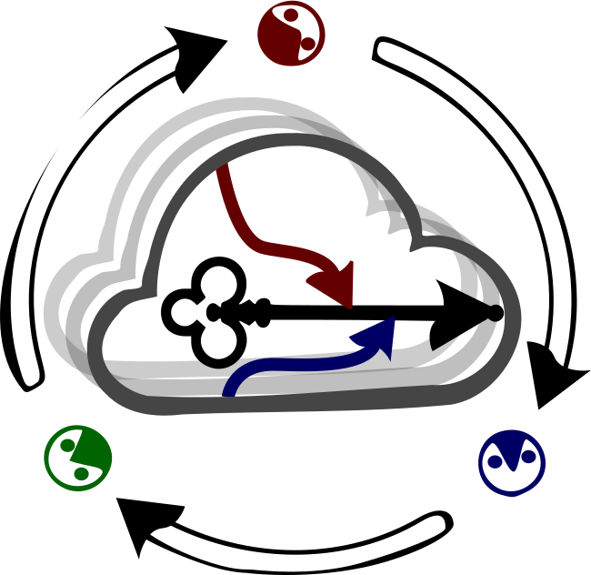

Test status from CircleCI: 

## Research Project
# CHAVE: Consolidation with High-Availability on Virtualized Environments
------------------------------

Hello, this is project CHAVE repo.
It was developed under master degree at UDESC, and finished in aug/2018.
For more info, read [this paper](http://dscar.ga/files/works/2017-DEP.pdf) or get more info in [CHAVE-Site](http://dscar.ga/chave).

- [x] [Install](../../wiki/Install)

- [x] [Resources](../../wiki/Resources)

The official documentation will be available on `Read the Docs` soon.  The code repository and issue tracker are on `GitHub` and often replicated to `SourceForge`.